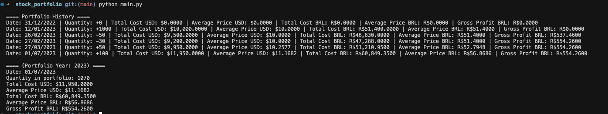

# Stock Portfolio Management System

> **Disclaimer:** This project is under active development. Features, usage, and outputs may change. Use at your own risk.

> **Disclaimer:** We emphasize project are merely auxiliary and do not replace the need for individual analysis. The proper use of this program is the responsibility of each individual, and it is always recommended to consult a personal accountant.

A professional-grade stock portfolio management system built with Clean Architecture principles. Automate the tracking of stock operations and generate comprehensive reports for Brazilian tax declaration (IRPF).

## Overview

This project simplifies the process of tracking stock information required for IRPF (Brazilian Income Tax Return) by:

- Processing stock operation data from PDF confirmations(E-trade)
- Calculating average purchase prices in USD and BRL
- Tracking profit/loss for each operation
- Total cost in the last day of the year in USD and BRL
- Generating yearly reports of portfolio performance
- Supporting multiple data sources (PDF confirmations, manual entries)
- Exporting data to CSV or XLSX files
## Features

- **Clean Architecture**: Modular design following SOLID principles for maximum maintainability
- **Multi-source Data Support**: Import operations from PDF confirmations or JSON files
- **Currency Conversion**: Automatic USD/BRL conversion using PTAX rates (BCB API)
- **Yearly Portfolio Tracking**: Separate tracking of operations by year
- **Detailed Reports**: Generate comprehensive reports including:
  - Operation history
  - Current position
  - Average purchase prices
  - Profit/loss calculations
  - Currency conversions
- **Export Options**: Export data to CSV or XLSX formats
- **Extensive Testing**: Unit and integration tests ensuring reliability
- **Type Safety**: Full type annotations for better IDE support and error prevention
- **Professional Code Quality**: Enterprise-level code following best practices

## Setup

1. Clone the repository:

```bash
git clone https://github.com/miguelslemos/stock_portfolio.git
cd stock_portfolio
```

2. Install dependencies:

```bash
pip install -r requirements.txt
```

## Data Gathering

### Reading from E-trade confirmations PDFs

Place your release confirmations PDFs in the `release_confirmations` directory

#### How to get the release confirmations PDFs

- Go to <https://us.etrade.com/etx/sp/stockplan/#/myAccount/stockPlanConfirmations>
- Download the release confirmations PDFs for the years you want to track
- Place the PDFs in the `release_confirmations` directory


#### How to get the trade confirmations PDFs

- Go to <https://us.etrade.com/etx/pxy/accountdocs-statements#/documents>
- Download the trade confirmations PDFs for the years you want to track
- Place the PDFs in the `trade_confirmations` directory
- If you do not have trade confirmations PDFs, remember to create an empty `trade_confirmations` directory


At the end you should have directories like that:


PS: The PDFs are searched recursively in the directories.

## Usage

### Running through Google Colab

- Make a copy of the [notebook](https://colab.research.google.com/drive/1XCkyP3vs808G27BasGQ9tp4QK14vG37d?authuser=1#scrollTo=SUgqsiI9xxHm)
- Run the notebook

### Running the program locally

Run the main script:

```bash
python main.py --pdf
```

The script will:

1. Process all operations from PDF confirmations
2. Calculate portfolio metrics
3. Generate yearly reports
4. Display current position and profit/loss information

### Program Arguments

The program supports several command-line arguments to customize its behavior:

#### Data Source Arguments
- `--pdf`: Process data from PDF confirmations
- `--json`: Path to JSON file containing operations data

Note: At least one data source (`--pdf` or `--json`) must be provided.

#### PDF Processing Options
- `--trade-confirmations`: Directory containing trade confirmation PDFs (default: `trade_confirmations/`)
- `--release-confirmations`: Directory containing release confirmation PDFs (default: `release_confirmations/`)

#### Export Options
- `--export`: Export format (choices: `csv` or `xlsx`, default: `none`)

#### Examples

```bash
# Process PDF confirmations and export to CSV
python main.py --pdf --export csv

# Process PDF confirmations with custom directories
python main.py --pdf --trade-confirmations custom_trades/ --release-confirmations custom_releases/

# Process JSON file and export to XLSX
python main.py --json operations.json --export xlsx

# Process both PDF and JSON data
python main.py --pdf --json operations.json --export csv
```

### JSON Data Format

You can provide operations data through a JSON file. This is useful for manual entries or when you don't have PDF confirmations. The JSON file should contain an array of operations, where each operation has the following format:

```json
[
  {
    "type": "vesting",
    "date": "01/06/2023",
    "quantity": 100,
    "price": 15.0
  },
  {
    "type": "trade",
    "date": "02/26/2023",
    "quantity": 50,
    "price": 12.0
  }
]
```

#### Operation Types

1. **Vesting Operation**
   - `type`: Must be "vesting"
   - `date`: Date in MM/DD/YYYY format
   - `quantity`: Number of shares
   - `price`: Price per share in USD

2. **Trade Operation**
   - `type`: Must be "trade"
   - `date`: Date in MM/DD/YYYY format
   - `quantity`: Number of shares
   - `price`: Price per share in USD

#### Example JSON File

Here's a complete example of a JSON file with multiple operations:

```json
[
  {
    "type": "vesting",
    "date": "01/06/2023",
    "quantity": 100,
    "price": 15.0
  },
  {
    "type": "trade",
    "date": "02/26/2023",
    "quantity": 50,
    "price": 12.0
  },
  {
    "type": "trade",
    "date": "02/27/2023",
    "quantity": 30,
    "price": 10.0
  },
  {
    "type": "vesting",
    "date": "07/01/2023",
    "quantity": 100,
    "price": 20.0
  },
  {
    "type": "vesting",
    "date": "03/27/2023",
    "quantity": 50,
    "price": 15.0
  }
]
```

Save this file as `operations.json` and use it with the `--json` argument:

```bash
python main.py --json operations.json --export csv
```

## Project Structure

- `main.py`: Entry point of the application
- `benefit_history.py`: Handles yearly portfolio tracking
- `year_portfolio.py`: Manages portfolio calculations and state
- `data_provider.py`: Handles data import from different sources
- `operation.py`: Defines operation types and processing logic
- `currency_service.py`: Manages currency conversion using PTAX rates

## Result Example



## Contributing

Contributions are welcome! Please feel free to submit a Pull Request.

## License

This project is licensed under the MIT License - see the LICENSE file for details.

## Future Feature Ideas

Here are some ideas for future improvements and features:

- [ ] **Automacatilly Download E-Trade PDFs**: Automatically download the PDFs from E-Trade.

Feel free to suggest more features or contribute to the development!

## Testing

There's almost no testing for this project yet. But we compared the output of this program with the output of the shared spreadsheet from E-Trade and they match.

## Architecture & Development

### Clean Architecture
This project follows Clean Architecture principles with clear separation of concerns:

- **Domain Layer**: Core business logic and entities
- **Application Layer**: Use cases and application services  
- **Infrastructure Layer**: External dependencies and adapters

For detailed architecture documentation, see: [docs/ARCHITECTURE.md](docs/ARCHITECTURE.md)

### Running Tests

Execute the full test suite:

```bash
# Run all tests
pytest

# Run only unit tests
pytest tests/test_domain_*.py

# Run integration tests
pytest tests/test_integration.py

# Run with coverage
pytest --cov=src
```

### Code Quality
- Full type annotations
- SOLID principles implementation
- Comprehensive test coverage
- Detailed documentation
- Clean, maintainable code structure

## Documentação em Português

Para entender todas as regras de negócio (preço médio, custo, lucro, câmbio, etc.), veja o guia completo:

- [docs/guia_negocio.md](docs/guia_negocio.md)
