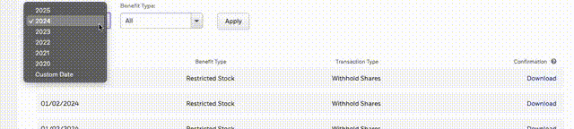

# Stock Portfolio Tracker

> **Disclaimer:** This project is under active development. Features, usage, and outputs may change. Use at your own risk.

> **Disclaimer:** We emphasize project are merely auxiliary and do not replace the need for individual analysis. The proper use of this program is the responsibility of each individual, and it is always recommended to consult a personal accountant.

A Python tool to automate the tracking of stock transactions and generate reports for Brazilian tax declaration (IRPF).

## Overview

This project simplifies the process of tracking stock information required for IRPF (Brazilian Income Tax Return) by:

- Processing stock transaction data from PDF confirmations(E-trade)
- Calculating average purchase prices in USD and BRL
- Tracking profit/loss for each transaction
- Total cost in the last day of the year in USD and BRL
- Generating yearly reports of portfolio performance
- Supporting multiple data sources (PDF confirmations, manual entries)

## Features

- **Multi-source Data Support**: Import transactions from PDF confirmations or manual entries
- **Currency Conversion**: Automatic USD/BRL conversion using PTAX rates(bacen API)
- **Yearly Portfolio Tracking**: Separate tracking of transactions by year
- **Detailed Reports**: Generate comprehensive reports including:
  - Transaction history
  - Current position
  - Average purchase prices
  - Profit/loss calculations
  - Currency conversions

## Setup

1. Clone the repository:
```bash
git clone https://github.com/miguelslemosstock_portfolio.git
cd stock_portfolio
```

2. Install dependencies:
```bash
pip install -r requirements.txt
```

## Data Gathering

### Reading from E-trade confirmations PDFs
Place your release confirmations PDFs in the `release_confirmations` directory

#### How to get the release confirmations PDFs

- Go to https://us.etrade.com/etx/sp/stockplan/#/myAccount/stockPlanConfirmations
- Download the release confirmations PDFs for the years you want to track
- Place the PDFs in the `release_confirmations` directory




#### How to get the trade confirmations PDFs

- Go to https://us.etrade.com/etx/pxy/accountdocs-statements#/documents
- Download the trade confirmations PDFs for the years you want to track
- Place the PDFs in the `trade_confirmations` directory


At the end you should have directories like that:


PS: The PDFs are searched recursively.

### Reading from manual entries
Unfortunatelly, We dont provide yet way to read from manual entries from configuration file. So for now, you need to manually create entries in the python code.

- Open the `main.py` file
- Create a list of transactions, using the following format:
```python

transactions = [
  SellTransaction(
      date=parse_date("02/26/2023"),
      quantity=50,
      price=12
  ),
  SellTransaction(
      date=parse_date("02/27/2023"),
      quantity=30,
      price=10
  ),             
  BuyTransaction(
      date=parse_date("07/01/2023"),
      quantity=100,
      price=20
  ),
  BuyTransaction(
      date=parse_date("03/27/2023"),
      quantity=50,
      price=15
  ),      
]
```
- Create a `StaticDataProvider` with the transactions and pass it to the `BenefitHistory` constructor.

```python
provider = StaticDataProvider(transactions=transactions)
benefit_history = BenefitHistory(data_provider=provider)
```

### PDFs Provider + Manual Entries

You can also use both providers together. Is good approach if you want to track your transactions from E-Trade and also have some manual entries like old carta statements.
```python
provider = MultDataProvider(providers=[
    PDFDataProvider(),
    StaticDataProvider(transactions=custom_transactions)
])
benefit_history = BenefitHistory(data_provider=provider)
```

## Usage

Run the main script:
```bash
python main.py
```

The script will:
1. Process all transactions from PDF confirmations
2. Calculate portfolio metrics
3. Generate yearly reports
4. Display current position and profit/loss information

## Project Structure

- `main.py`: Entry point of the application
- `benefit_history.py`: Handles yearly portfolio tracking
- `year_portfolio.py`: Manages portfolio calculations and state
- `data_provider.py`: Handles data import from different sources
- `transaction.py`: Defines transaction types and processing logic
- `currency_service.py`: Manages currency conversion using PTAX rates

## Contributing

Contributions are welcome! Please feel free to submit a Pull Request.

## License

This project is licensed under the MIT License - see the LICENSE file for details. 


## Future Feature Ideas

Here are some ideas for future improvements and features:

- [ ] **Customize the data provider via configuration file**: Allow the user to customize the data provider and entries via a configuration file.
- [ ] **Automacatilly Download E-Trade PDFs**: Automatically download the PDFs from E-Trade.


Feel free to suggest more features or contribute to the development!

## Testing

There's almost no testing for this project yet. But we compared the output of this program with the output of the shared spreadsheet from E-Trade and they match. 


