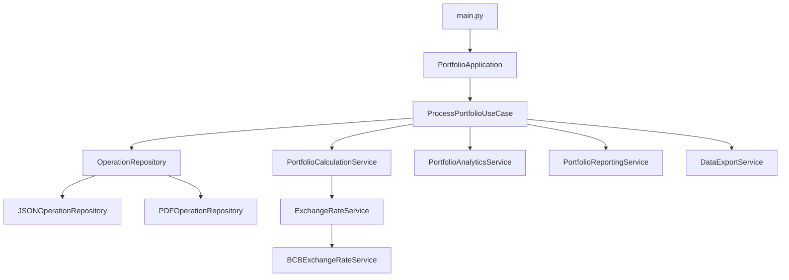

# Arquitetura do Sistema

## Visão Geral

O Sistema de Gerenciamento de Portfólio de Ações foi refatorado seguindo os princípios da **Clean Architecture** e **SOLID**, proporcionando maior manutenibilidade, testabilidade e extensibilidade.

## Estrutura de Camadas

### 1. Domain Layer (`src/domain/`)
**Responsabilidade**: Contém as regras de negócio centrais e entidades do domínio.

#### Entidades (`entities.py`)
- `Money`: Valor monetário com moeda
- `StockQuantity`: Quantidade de ações
- `ExchangeRate`: Taxa de câmbio com conversão automática
- `PortfolioPosition`: Posição atual do portfólio
- `OperationResult`: Resultado de uma operação

#### Operações (`operations.py`)
- `PortfolioOperation`: Interface base para operações
- `VestingOperation`: Operação de vesting (recebimento de ações)
- `TradeOperation`: Operação de trade (venda de ações)

#### Serviços de Domínio (`services.py`)
- `ExchangeRateService`: Interface para serviço de câmbio
- `PortfolioCalculationService`: Cálculos do portfólio
- `PortfolioAnalyticsService`: Análises e métricas

### 2. Application Layer (`src/application/`)
**Responsabilidade**: Casos de uso e orquestração da lógica de aplicação.

#### Casos de Uso (`use_cases.py`)
- `ProcessPortfolioUseCase`: Processamento completo do portfólio
- `CreateOperationUseCase`: Criação de novas operações
- `CalculatePortfolioValueUseCase`: Cálculo de valor atual

#### Protocolos
- `OperationRepository`: Interface para acesso a dados
- `PortfolioReportingService`: Interface para relatórios
- `DataExportService`: Interface para exportação

### 3. Infrastructure Layer (`src/infrastructure/`)
**Responsabilidade**: Implementações concretas e integrações externas.

#### Repositórios (`repositories.py`)
- `JSONOperationRepository`: Carrega operações de JSON
- `PDFOperationRepository`: Extrai operações de PDFs
- `CompositeOperationRepository`: Combina múltiplos repositórios

#### Serviços Externos (`exchange_rate.py`)
- `BCBExchangeRateService`: Integração com API do Banco Central
- `MockExchangeRateService`: Mock para testes
- `CachedExchangeRateService`: Decorator com cache

#### Apresentação (`presentation.py`)
- `ConsolePortfolioReporter`: Relatórios no console
- `SilentPortfolioReporter`: Relatórios silenciosos

#### Exportação (`export.py`)
- `CSVExporter`: Exportação para CSV
- `XLSXExporter`: Exportação para Excel
- `NoOpExporter`: Exportação nula
- `ExporterFactory`: Factory para exportadores

## Princípios Aplicados

### SOLID

#### Single Responsibility Principle (SRP)
- Cada classe tem uma única responsabilidade bem definida
- Separação clara entre entidades, operações, serviços e repositórios

#### Open/Closed Principle (OCP)
- Sistema extensível através de interfaces e abstrações
- Novos tipos de operação podem ser adicionados sem modificar código existente

#### Liskov Substitution Principle (LSP)
- Implementações concretas podem substituir interfaces sem quebrar funcionalidade
- Polimorfismo bem implementado em operações e serviços

#### Interface Segregation Principle (ISP)
- Interfaces específicas e focadas (ex: `OperationRepository`, `ExchangeRateService`)
- Clientes dependem apenas das interfaces que realmente usam

#### Dependency Inversion Principle (DIP)
- Camadas superiores dependem de abstrações, não de implementações concretas
- Injeção de dependência utilizada em toda aplicação

### Padrões de Design

#### Command Pattern
- `PortfolioOperation` e suas implementações encapsulam operações como objetos
- Permite desfazer, enfileirar e registrar operações

#### Factory Pattern
- `ExporterFactory` cria exportadores baseado no formato
- Centraliza criação de objetos complexos

#### Decorator Pattern
- `CachedExchangeRateService` adiciona cache a qualquer serviço de câmbio
- Permite extensão de funcionalidade sem modificar código original

#### Repository Pattern
- Abstração do acesso a dados através de `OperationRepository`
- Permite diferentes fontes de dados (JSON, PDF, banco de dados)

#### Strategy Pattern
- Diferentes estratégias de exportação e relatório
- Algoritmos intercambiáveis em tempo de execução

## Fluxo de Execução

## Benefícios da Refatoração

### Manutenibilidade
- Código bem organizado em camadas com responsabilidades claras
- Fácil localização e modificação de funcionalidades
- Documentação abrangente e código autodocumentado

### Testabilidade
- Dependências injetadas facilitam criação de mocks
- Testes unitários isolados para cada componente
- Testes de integração para fluxos completos

### Extensibilidade
- Novos tipos de operação podem ser adicionados facilmente
- Novos formatos de exportação via factory pattern
- Novas fontes de dados através de repositórios

### Robustez
- Tratamento de erro centralizado
- Validação de dados nas entidades
- Logs estruturados para debugging

## Como Adicionar Novas Funcionalidades

### Nova Operação
1. Criar classe herdando de `PortfolioOperation`
2. Implementar lógica de negócio no método `execute()`
3. Adicionar factory method em `CreateOperationUseCase`

### Novo Formato de Exportação
1. Implementar `DataExportService`
2. Adicionar à `ExporterFactory`
3. Atualizar argumentos CLI se necessário

### Nova Fonte de Dados
1. Implementar `OperationRepository`
2. Adicionar à `CompositeOperationRepository`
3. Atualizar configuração da aplicação

### Novo Serviço de Câmbio
1. Implementar `ExchangeRateService`
2. Configurar na inicialização da aplicação
3. Adicionar cache se necessário com decorator
